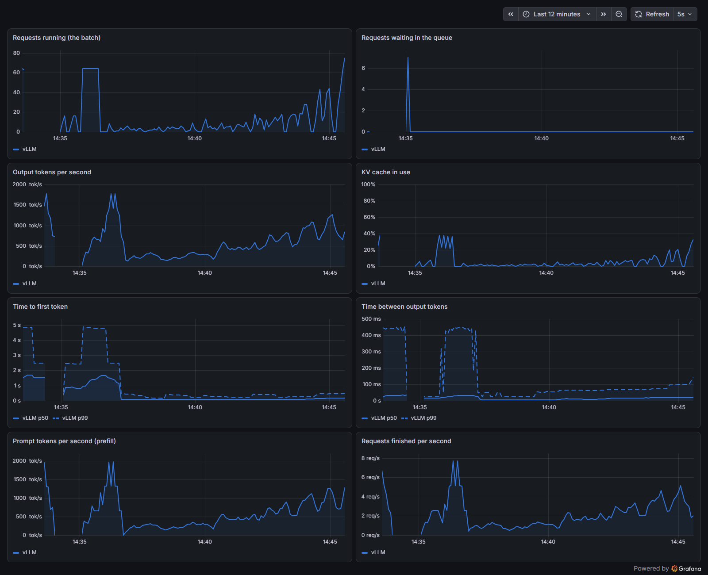

# Findings

Every number below comes with its setup. Unless a section says otherwise:

- **GPU:** NVIDIA RTX 3090 (24 GB, Ampere, sm_86), shared with the Windows
  desktop (~2.5 GB of it), in Windows 10 + WSL2 (kernel 6.18.33.2), driver
  591.74.
- **Engines:** vLLM 0.30.0 (official Docker image or pip), SGLang v0.5.20
  (official Docker image).
- **Model:** Qwen3-8B-AWQ (4-bit weights, Marlin kernels), served through the
  OpenAI-compatible API.
- **KV cache pinned to 84,352 tokens** in every run, on both engines.
- **Load:** `vllm bench serve`, random prompts of 256 tokens in and 256 out,
  EOS ignored, greedy, a fresh random seed per concurrency level (so the
  prefix cache can't flatter a repeat).
- **Comparisons alternate arms** (A, B, A, B) within one session.

---

## 1. Batching: 107 to 1,630 tokens per second

vLLM, native install, one clean session:

| Concurrent requests | Output tokens/s | Time per output token |
|---|---|---|
| 1 | 107 | 9.0 ms |
| 4 | 383 | 9.5 ms |
| 16 | 1,057 | 12.3 ms |
| 64 | 1,630 | 33.7 ms |

- **A single stream is bound by memory bandwidth.** Each new token requires
  reading every weight once: 4.86 GB per step here. At the 3090's 936 GB/s
  that's a floor of 5.2 ms per token; the measured 9.0 ms is 58% of peak
  bandwidth. (Section 3 shows where the rest goes.)
- **Batching amortizes that read.** One pass over the weights serves every
  request in the batch, so throughput rises ~15x by 64 requests while each
  request's tokens slow down.
- **Docker costs nothing measurable:** the official image was within 2% of
  the native install at every level (alternated 2 vs 2).

## 2. vLLM vs SGLang

Same model, same KV capacity, same client, arms alternated, 2 runs each.
SGLang with its decode CUDA graphs extended to batch 64
(`--cuda-graph-max-bs-decode 64`):

| Concurrent | vLLM (tok/s, each run) | SGLang-64 (tok/s, each run) | Δ | First token, median, vLLM / SGLang |
|---|---|---|---|---|
| 1 | 103, 107 | 130, 130 | +23% | 75 / 70 ms |
| 4 | 368, 380 | 452, 455 | +21% | 243 / 244 ms |
| 16 | 1,019, 1,063 | 1,229, 1,233 | +18% | 802 / 881 ms |
| 64 | 1,614, 1,627 | 1,697, 1,698 | +4.7% | 1,357 / 2,361 ms |

- **At SGLang's defaults it loses at 64 (−16%).** Its decode graphs stop at a
  smaller batch size; raising the limit fixed that.
- **The trade-off:** SGLang streams tokens faster, while vLLM gets the first
  token out sooner under heavy load (1.36 s vs 2.36 s at 64).
- **Most of SGLang's lead is vLLM idling on WSL2** (sections 3 and 4). With
  pinned memory on, vLLM reached 1,690 tokens/s at 64, level with SGLang's
  1,697 (separate runs, the same night, same settings).

## 3. Where one decoding step goes

One request (244-token prompt, 64 greedy tokens), profiled with each engine's
torch profiler. Kernels were grouped per step; the prefill step and the edges
were dropped.

| Per decode step, batch 1 | vLLM 0.30.0 | SGLang v0.5.20 |
|---|---|---|
| **Time per token (unprofiled)** | **8.85 ms** | **7.29 ms** |
| GPU busy | 7.56 ms | 7.15 ms |
| 4-bit matrix multiplies (Marlin, 3.61 GB read) | 5.15 ms (75% of peak bandwidth) | 4.90 ms (79%) |
| Output layer (1.245 GB, fp16) | 1.41 ms (94%) | 1.41 ms (95%) |
| Attention + KV write | 0.63 ms | 0.59 ms |
| Norms, rotary, activation, sampling, copies | ~0.4 ms | ~0.3 ms |
| **GPU idle (time per token − busy)** | **1.29 ms** | **0.14 ms** |

The two engines do nearly the same GPU work. Of vLLM's 1.56 ms deficit,
1.15 ms is idle time, 0.25 ms a slower build of the 4-bit kernel, and
0.04 ms attention.

## 4. Pinned memory on WSL2: 12% of vLLM's decode speed

**Cause.** On WSL2, vLLM leaves pinned (page-locked) host memory off unless
`VLLM_WSL2_ENABLE_PIN_MEMORY=1`. Since vLLM's V2 model runner became the
default, it falls back to device memory for its UVA buffers, and its small
per-step host-to-device copies come from pageable memory. Each such copy
makes the CPU wait for the GPU, which breaks the overlap between preparing
step N+1 and running step N.

In the profile of one 64-token request:

| | Setting off (default) | Setting on |
|---|---|---|
| Host-to-device copies from pageable memory | 1,218 | 0 |
| Host-to-device copies from pinned memory | 0 | 135 |
| `cudaStreamSynchronize` calls | 1,082 | 0 |
| GPU busy per step | 7.56 ms | 7.61 ms |
| GPU idle per step | 1.29 ms | 0.16 ms |

**Effect,** off/on alternated, 2 runs per arm, 3 timed requests per run
(median gap between streamed tokens):

| Time per output token, batch 1 | Default | `VLLM_WSL2_ENABLE_PIN_MEMORY=1` |
|---|---|---|
| Docker image, AWQ | 8.69-8.88 ms | 7.65-7.79 ms |
| pip install, AWQ | 8.81-9.02 ms | 7.75-7.81 ms |
| Docker image, BF16 (16.4 GB) | 21.30-21.93 ms | 20.18-20.38 ms |

- A fixed ~1.1-1.2 ms per step whatever the model's size: ~12% of a 9 ms
  step, ~5.5% of a 21 ms one.
- Throughput (full sweep): +14% at 1 request, +13% at 4, +8% at 16, +3.8% at 64.
- **Alternatives ruled out before filing.**
  - Drift: every off run is slower than every on run; the ranges never
    overlap.
  - Other settings: the startup logs are identical apart from the warning.
  - Compiled code: the setting changes vLLM's compile-cache key, so the two
    arms loaded different artifacts, but all 77 compiled kernels are
    identical instruction for instruction.
- In June 2026, when pinned memory was first allowed on WSL2, a <2%
  throughput cost was measured (RTX 5080, a 4B model), and the default was
  kept off. A vLLM maintainer later suggested evaluating the default.
  **Filed as [vLLM #58849](https://github.com/vllm-project/vllm/issues/58849).**

## 5. How you load-test changes what you see

**Closed loop vs open loop.** A fixed set of clients, each waiting for its
answer, produces synchronized waves: everyone's prefill lands at once. With
requests arriving at random (Poisson) times instead:

| Offered req/s | Output tok/s | First token, median / p99 | Time per token, median |
|---|---|---|---|
| 1 | 252 | 87 / 259 ms | 10.0 ms |
| 3 | 735 | 94 / 324 ms | 13.7 ms |
| 5 | 1,182 | 128 / 399 ms | 24.8 ms |
| 6 | 1,310 | 210 / 456 ms | 46.9 ms |

- At about the same throughput, the median first token took **~830 ms with
  16 closed-loop clients vs 94 ms with Poisson arrivals** at 3 req/s: about
  9x lower.
- **Overload didn't make a queue.** At 6 req/s nothing waited: continuous
  batching admitted every arrival (the KV cache had room), and every stream
  slowed instead (time per token 10 → 47 ms).
- **Little's law holds.** The average number of requests in flight (from
  Prometheus) matched arrival rate × time in system within −10% to +5% at
  every rate, once both used the same time window.
- **The dashboard agrees with the client, if you read it right.** Prometheus'
  token counter matched the load generator within 1.1%. But a 30-second rate
  window on the chart read 13% low during a ~40-second burst: the window
  smooths over the ramp-up.

## 6. A noisy neighbor

The 3090 also drives the display. A browser window playing a full-screen
animation, alternated with none:

| | Nothing else | Animated browser |
|---|---|---|
| 1 request: tok/s (time per token) | 108 (8.9 ms), 107 (9.0 ms) | 91 (10.7 ms), 87 (11.1 ms) |
| 64 requests: tok/s | 1,619, 1,628 | 1,374, 1,349 |

The browser's GPU process used 34% of the GPU's 3D engine, per Windows'
GPU-engine counters, while CPU use barely moved: GPU time-slicing, not CPU
contention. Every later measurement ran with those counters logged
(`scripts/win-gpu-monitor.ps1`).

## 7. 4-bit vs full precision: 2.5x faster, 1.7 points on GSM8K

Qwen3-8B-AWQ vs Qwen3-8B (BF16), same server settings (KV 21,840 tokens,
max length 4,096), [lm-evaluation-harness](https://github.com/EleutherAI/lm-evaluation-harness)
0.4.13, GSM8K test set (1,319 questions), 5-shot, greedy, 16 concurrent:

| | AWQ (4-bit) | BF16 |
|---|---|---|
| GSM8K, flexible-extract | 86.7% | 88.3% |
| GSM8K, strict-match | 86.4% | 88.0% |
| Time per token, 1 request | 9.0 ms | 22.1 ms |

- **The paired test finds a real, small cost.** The runs disagree on 104
  questions; full precision wins 63 of them and 4-bit 41 (McNemar exact test,
  p = 0.039). Comparing the two accuracies alone (±0.9 each) couldn't show
  that.
- I predicted "within 2 points" (held) and "no significant difference"
  (wrong).

<!-- PENDING: the AWQ-vs-AWQ replicate (the noise floor for this test). -->

## 8. Prefix caching: a shared prompt, computed once

Many requests share a long beginning: a chatbot's system prompt, or a
document that many questions are asked about. Prefix caching keeps the KV
cache (the model's computed working state) for that shared part and reuses
it, instead of recomputing it for every request.

Two workloads, 128 output tokens, greedy, arms alternated (off, on, off, on):
- **Shared:** a 2,000-token prefix common to every request, plus 200 unique
  tokens.
- **Unique (the control):** 2,200 unique tokens, nothing shared.

**vLLM, shared prefix,** both runs of each arm:

| Concurrent | Output tok/s, off → on | First token, median, off → on | Time per token, off → on |
|---|---|---|---|
| 1 | 75 → 99 (+32%) | 519 → 79 ms (6.6x faster) | 9.3 → 9.3 ms |
| 4 | 150 → 304 (2.0x) | 1,526 → 227 ms (6.7x) | 15.1 → 10.9 ms |
| 16 | 197 → 667 (3.4x) | 1,938 → 724 ms (2.7x) | 66.2 → 17.5 ms |

- **The control moved less than 1%** at every level: caching costs nothing
  measurable when nothing is shared. Cache hits were 85-90% of prompt tokens
  on the shared workload and 0% on the control, exactly as the arithmetic
  predicts.
- **Without caching, long prompts slow everyone's streaming.** At 16
  requests, each output token took 66 ms instead of 17.5, because every step
  also carried pieces of someone's 2,200-token prompt.
- **The tail is where it shows most:** at 16 requests the slowest first
  tokens took 8.3 s without caching and 1.6 s with it.
- All five pre-registered predictions held.

**SGLang** (its version is called RadixAttention), same workloads, both runs
of each arm:

| Concurrent | Output tok/s, off → on | First token, median, off → on |
|---|---|---|
| 1 | 83 → 116 (+40%) | 544 → 71 ms (7.7x faster) |
| 4 | 156 → 345 (2.2x) | 1,904 → 236 ms (8.1x) |
| 16 | 202 → 805 (4.0x) | 4,984 → 842 ms (5.9x) |

The control again moved less than 1.5%.

**The two schedulers differ in who waits.** With 16 long prompts and no
caching, both engines produced the same throughput (197 vs 202 tokens/s).
- vLLM mixed the long prefills into every step: first tokens came sooner
  (1.9 s median), but each output token took 66 ms.
- SGLang held prefills back: tokens streamed at 41 ms each, but the first
  one took 5.0 s.

Same work, different people waiting. It's the trade-off from section 2,
sharper under prompt-heavy load.

## 9. Speculative decoding

<!-- PENDING (queued 2026-09-26): none vs Qwen3-0.6B draft (k=4) vs n-gram
prompt lookup (k=4), Spec-Bench prompts. -->

## 10. Kernels compiled in the middle of traffic

When vLLM's FlashInfer sampler can't be used (for example, without the CUDA
compiler installed), it falls back to Triton kernels that compile the first
time each batch shape appears, during live traffic. Measured on the pip
install with `VLLM_USE_FLASHINFER_SAMPLER=0`, default sampling, runs
alternated:

- With a fresh cache and no warmup, those compiles cost **38% of throughput
  at 16 requests, and the 99th-percentile first token went from 1.1 s to
  5.7 s** (replicated).
- One short run compiled 26 kernel variants. vLLM's default JIT monitor
  reported 4, because it warns once per kernel name.
- Registering the kernels in vLLM's startup warmup costs 96 s once, then
  0.23 s per start with a persistent cache.

## 11. Determinism at temperature 0 (pilot)

Temperature 0 means "always pick the most likely token", so the same prompt
should give the same answer. Twenty-four questions from the
[Recall or Reason](https://github.com/joynerwk03/recall-or-reason) bank,
greedy, 256 tokens; each run alone, then inside a busy batch.

| vLLM 0.30.0, 24 prompts | Outputs identical | Outputs different |
|---|---|---|
| Alone vs alone, prefix caching on (default) | 19 | 5 |
| Alone vs alone, prefix caching off | **24** | 0 |
| Alone vs inside a busy batch, caching off | 19-20 | 4-5 |
| Same, with `VLLM_BATCH_INVARIANT=1` | 23 | 1 |

- **Prefix caching changes results, not just speed.** A cached prompt skips
  part of the prefill arithmetic, and near-tied tokens can flip.
- **Batching does too**, because kernels split their sums differently at
  different batch sizes.
- vLLM's batch-invariant mode removed all but one divergence, at a steep
  price with a 4-bit model: **86% slower at one request** (15 vs 106
  tokens/s). It replaces the 4-bit Marlin kernels with dequantize-then-
  multiply.
- A pilot for a larger study; the prompt set is small.

## 12. Things that broke

- **vLLM 0.30.0 crashed at startup without the CUDA compiler**
  ([#49497](https://github.com/vllm-project/vllm/issues/49497)): its
  FlashInfer sampler compiles on first use, with no fallback. I tested the
  open fixes on the release:
  [#51741](https://github.com/vllm-project/vllm/pull/51741#issuecomment-5837141860)
  works, including when a compiler is found but fails. The other candidate
  no longer covered the bug
  ([update](https://github.com/vllm-project/vllm/issues/49497#issuecomment-5837173089)).
- **SGLang's deterministic mode crashed on this GPU** (sm_86): a kernel
  config needed 106,496 bytes of on-chip shared memory, and the 3090 allows
  101,376. I tested both open fixes: both start the server and keep the
  kernel batch-invariant bit for bit
  ([report](https://github.com/sgl-project/sglang/pull/34486#issuecomment-5848388567)).

## 13. Running on WSL2: practical notes

- Turn on `VLLM_WSL2_ENABLE_PIN_MEMORY=1` for vLLM (section 4).
- **GPU memory counts against Windows' memory commit.** A server holding
  ~20 GB of VRAM grew Windows' pagefile on C: by that much, and C: once fell
  to 0.23 GB free mid-run. Leave room on the system drive, or keep the KV
  cache no bigger than the workload needs. `scripts/win-disk-watchdog.ps1`
  stops the containers before the drive fills.
- **Keep animated windows off the GPU while measuring** (section 6).
- Model weights mounted from another Windows drive loaded as fast as from a
  Docker volume (~52 s for 5.7 GB; vLLM's loader was the limit).

## Predictions that were wrong

Every experiment was pre-registered. These predictions failed, and each
taught something:

- **"The Grafana chart matches the client within 10%."** It read 13% low: a
  30-second rate window smooths a 40-second burst (section 5).
- **"Overload makes a queue."** It made slower streams instead (section 5).
- **"A noisy neighbor hurts batch-1 more than batch-64."** Both lost ~15-20%
  (section 6).
- **"Two alone runs at temperature 0 are identical."** Not with prefix
  caching on (section 11).
- **"Batch-invariant mode removes every divergence."** One of 24 remained
  (section 11).
- **"Pinned memory barely matters at 64 requests (<3%)."** It was 3.8%
  (section 4).
- **"4-bit and full precision aren't significantly different on GSM8K."**
  The paired test says they are (section 7).
- **"A Docker volume loads weights 2x faster than a mounted folder."** Both
  took ~52 s (section 13).
