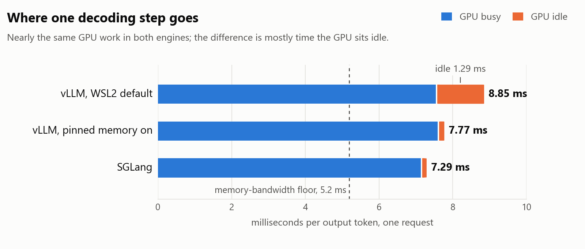
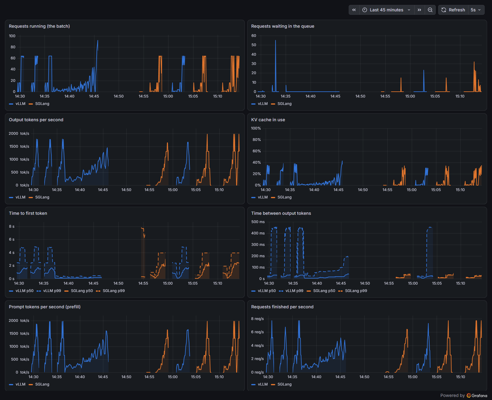

# LLM Serving Lab

I wanted to understand how large language models are served in production:
what actually happens between a request arriving and tokens streaming back,
and what makes it fast or slow. So I ran the two leading open-source serving
engines, [vLLM](https://github.com/vllm-project/vllm) and
[SGLang](https://github.com/sgl-project/sglang), on one consumer GPU (an RTX
3090) and measured them carefully. I predicted every result before measuring
it, and reported what broke to the projects themselves.

Everything here uses one model, Qwen3-8B, mostly in its 4-bit version
(AWQ), served through an OpenAI-compatible API.

## What I found

**Batching is where the throughput comes from.** One user at a time got 107
tokens per second. Sixty-four users at once got 1,630: about 15x more from the
same GPU. A single user is limited by how fast the GPU can read the model's
weights from memory (9.0 ms per token, against a physical floor of 5.2 ms).
With many users, each read of the weights serves everyone.

**A default setting cost vLLM about 12% on Windows (WSL2).** A profile of
one decoding step showed the GPU sitting idle 1.3 ms of every ~9 ms. The cause
was a WSL2 default that leaves "pinned" memory off, so every step's small
copies to the GPU made the CPU stop and wait (1,218 such copies and 1,082 waits
in one short request). Turning the setting on removed the waits and cut time
per token from 8.7-9.0 to 7.7-7.8 ms. I checked the alternatives (drift,
other config changes, the compiled code) before filing it with vLLM as
[issue #58849](https://github.com/vllm-project/vllm/issues/58849).

**SGLang was faster than vLLM here, and mostly because of that idle time.**
SGLang was 18-23% faster from 1 to 16 users and 4.7% faster at 64 (after
raising its CUDA-graph limit; its default loses at 64). Profiling showed the
two engines' GPU work per step within 5% of each other: most of the gap was
vLLM's idle time. With pinned memory on, vLLM's 64-user throughput (1,690
tokens/s) matched SGLang's (1,697).

<picture>
  <source media="(prefers-color-scheme: dark)" srcset="images/decode-step-dark.png">
  
</picture>

**How you test changes what you see.** With a fixed set of 16 clients that
each wait for their answer, requests arrive in synchronized waves, and the
first token took ~830 ms. With requests arriving at random times (a Poisson
process) at about the same throughput, it took under 110 ms. And past the
server's comfortable load, requests didn't queue: every stream just got
slower.

**Another program on the same GPU cost 16-19%.** An animated browser window
used a third of the GPU's graphics engine, and serving throughput dropped
accordingly. Since then, every measurement here runs with a monitor that
logs other programs using the GPU.

**Reusing a shared prompt changes everything downstream of it.** When every
request began with the same 2,000-token prompt (like a chatbot's system
prompt), caching it made the first token arrive 6.6x sooner for one user and
more than tripled throughput for sixteen. With nothing shared, it cost
nothing.

**4-bit weights are 2.5x faster and measurably less accurate.** On a
grade-school math benchmark (GSM8K, 1,319 questions), the 4-bit model scored
86.7% against full precision's 88.3%. That gap is small, but a paired test
says it's real (p = 0.04).

<!-- PENDING (running 2026-09-26): speculative decoding; the 4-bit
replicate. -->

More detail, with every setup and table: [FINDINGS.md](FINDINGS.md).

## Contributions upstream

- **vLLM [#58849](https://github.com/vllm-project/vllm/issues/58849)**: the
  pinned-memory data above, filed as a performance issue with a reproduction.
- **vLLM [#51741](https://github.com/vllm-project/vllm/pull/51741#issuecomment-5837141860)**:
  tested an open fix for a startup crash
  ([#49497](https://github.com/vllm-project/vllm/issues/49497)) on the 0.30.0
  release, including an edge case the PR didn't cover.
- **vLLM [#49497](https://github.com/vllm-project/vllm/issues/49497#issuecomment-5837173089)**:
  a status update showing the other candidate fix no longer covered the bug.
- **SGLang [#34486](https://github.com/sgl-project/sglang/pull/34486#issuecomment-5848388567)**:
  SGLang's deterministic mode crashes on this GPU generation (sm_86). I
  tested both open fixes, which the fix's author had asked someone to do.

## How the measurements work

- **Predictions first.** Before each experiment I wrote down what I expected
  and what result would prove me wrong. Several predictions were wrong; those
  are reported too.
- **Alternating runs.** Comparisons alternate A, B, A, B, so drift in the
  machine (heat, background load) can't masquerade as a difference.
- **Same-session controls.** Numbers from different days aren't compared
  directly; this desktop varied by as much as 25% between sessions.
- **Fixed capacity.** The KV cache (the model's working memory for each
  conversation) is pinned to the same size in every run, so no comparison
  hides a difference in memory.
- **Checked against the source.** When a flag or number mattered, I read the
  engine's code instead of trusting memory or docs.

## Reproducing

You need an NVIDIA GPU with 24 GB (a 3090 or 4090), Docker with GPU support,
and about 10 GB for the 4-bit model. This lab ran on Windows 10 with WSL2;
the notes in [FINDINGS.md](FINDINGS.md) cover WSL2's quirks.

```bash
# the model, into ~/models (set MODELS to put it elsewhere)
bash scripts/get-model.sh Qwen/Qwen3-8B-AWQ

# a Python environment for the benchmark client
uv venv .venv --python 3.12 && uv pip install --python .venv/bin/python "vllm==0.30.0"

# Prometheus + Grafana (http://127.0.0.1:3000, dashboard provisioned)
docker compose -f docker/compose.yaml up -d

# serve, measure, stop
bash scripts/docker-vllm.sh start demo
bash scripts/sweep.sh results/demo --temperature 0     # concurrency 1, 4, 16, 64
python3 scripts/summarize.py results/demo
bash scripts/docker-vllm.sh stop demo
```

Each experiment has a runner in [`experiments/`](experiments/), and
`scripts/docker-sglang.sh` serves the same model with SGLang for comparison.

## Layout

| Path | What |
|---|---|
| `scripts/` | Serve (vLLM, SGLang), load-test (closed loop and Poisson), profile, summarize |
| `experiments/` | One runner per experiment in FINDINGS.md |
| `docker/` | Prometheus and Grafana, with the dashboard below |
| `images/` | Dashboard screenshots |
| `data/` | Spec-Bench prompts (Apache-2.0), downloaded by the speculative-decoding runner |



## A note on how this was built

I ran these experiments with Claude Code (Anthropic's coding agent) as a
pair: it ran and logged the runs and drafted much of this write-up; I chose
the questions, set the predictions, and reviewed every result and every
number here.

## License

MIT
